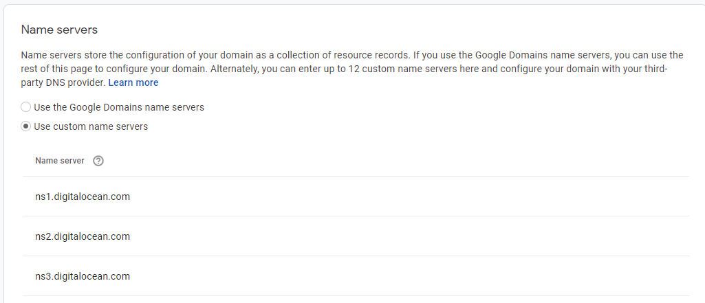
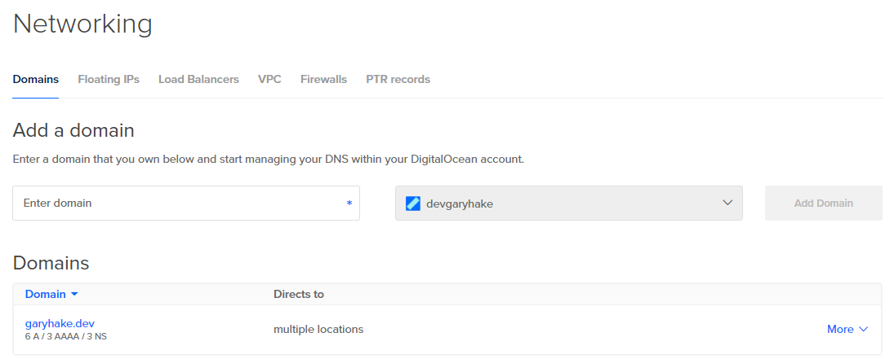
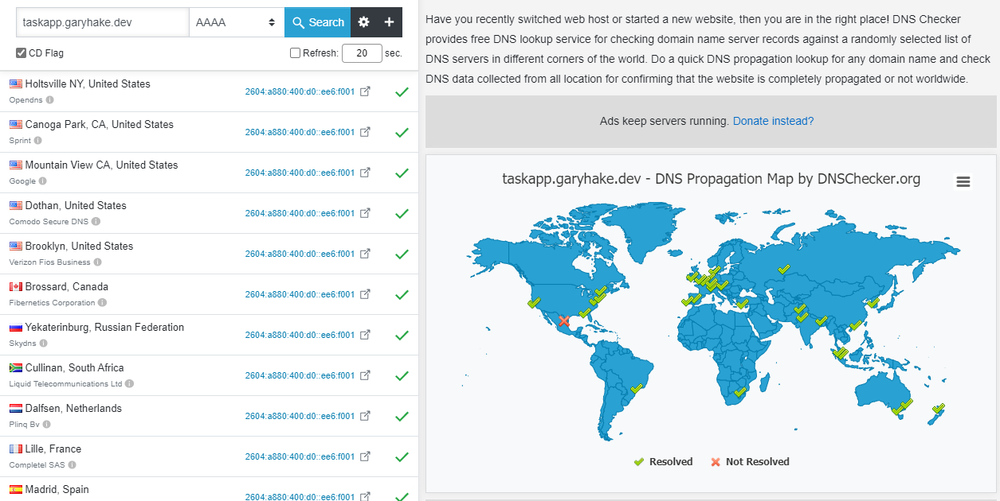

# Domains

1. There's lots of places to buy a domain
   - Pick your favorite and what'll save you the most money
   - domains.google is what I used
1. I used custom name servers from Digital Ocean
   - [DO Documentation](https://www.digitalocean.com/community/tutorials/how-to-point-to-digitalocean-nameservers-from-common-domain-registrars#registrar-google-domains)
   - This lets me manage my DNS from DO
     
1. Add your domain to DO
   - [Documentation](https://www.digitalocean.com/docs/networking/dns/how-to/add-domains/)
   - Create > Domains/DNS
   - Enter domain into name field and Add Domain
     
1. You've done all of this because you want to host an app
   - It requires a sub domain
   - [How to Add](https://www.digitalocean.com/docs/networking/dns/how-to/add-subdomain/)
     
   - The key is you have two 'A' records and one 'AAAA' record
1. To make sure this is working from this end
   - You need to check the DNS
   - [DNS Checker](https://dnschecker.org/#AAAA/taskapp.garyhake.dev)
     
1. This is just the start of getting an app running
   - We know now that we can at least hit these urls when we get an app copied over to the server (at least over http)
   - We aren't secured for https on the server yet

Check out the LAMP walkthrough in this folder on how to secure an app that's deployed on a droplet in DO

## Netlify

[Netlify](https://app.netlify.com/)

- So, Digital Ocean is what we are using to manage our DNS
- But say we have apps on other services
- In this case, netlify will generate a site url for you and encrypt it
  - https://forkify-gary-ci.netlify.app/
- In my case, I want all my personal apps to follow the below naming
  - app.garyhake.dev
- So, in Netilfy we will be adding a 'custom domain'

1. In Digital Ocean, add a CNAME Record to tie your DNS subdomain to the netlify url
   
1. Head over to Netlify and add a Domain Alias to your app
   
1. It will take up to 48 hours (but probably way less) for your DNS to propogate
   - Netlify should validate your DNS eventually
   - Then it will auto generate a cert for your site
