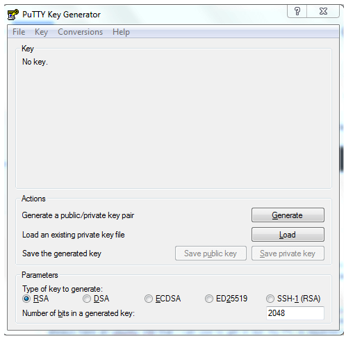
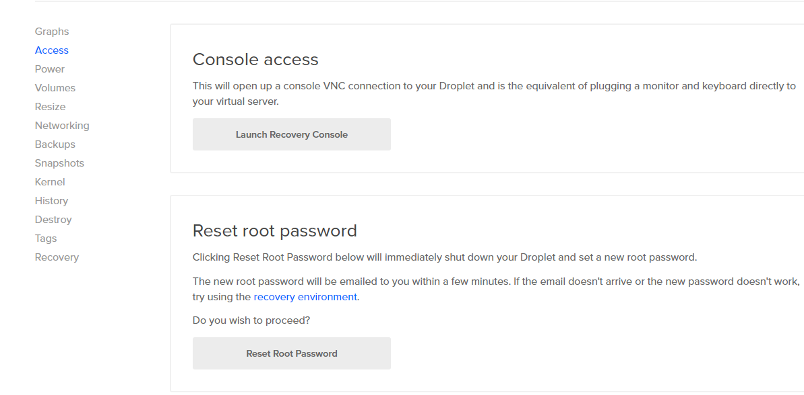
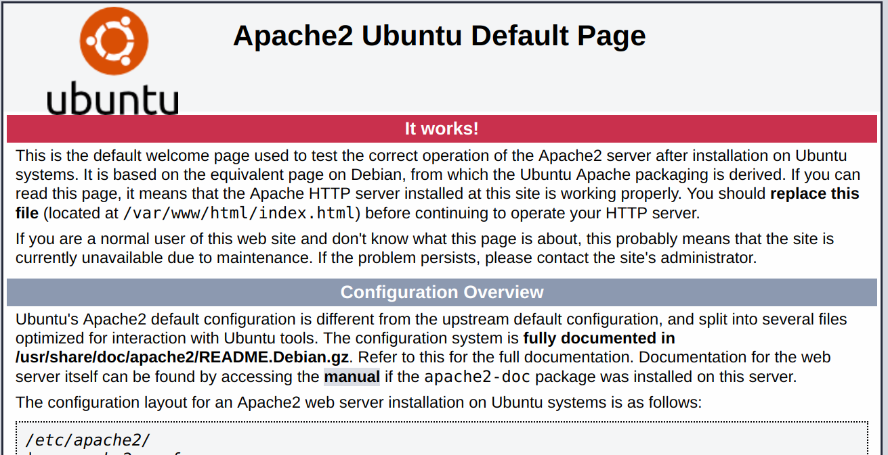
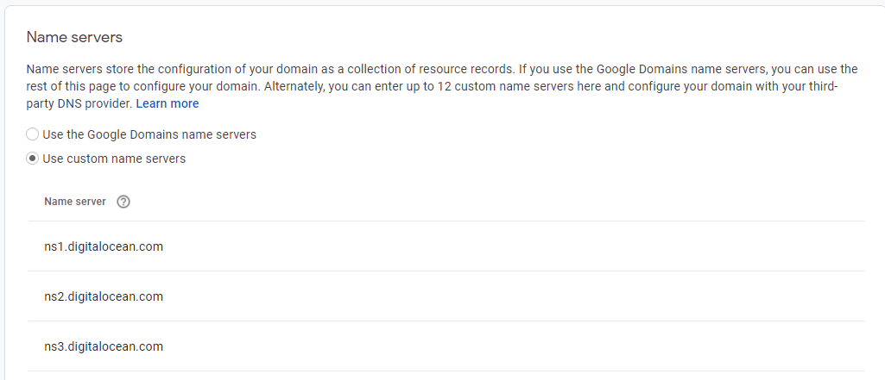
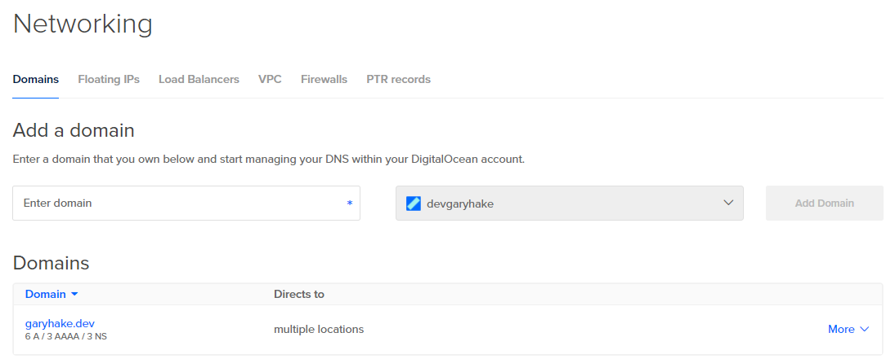
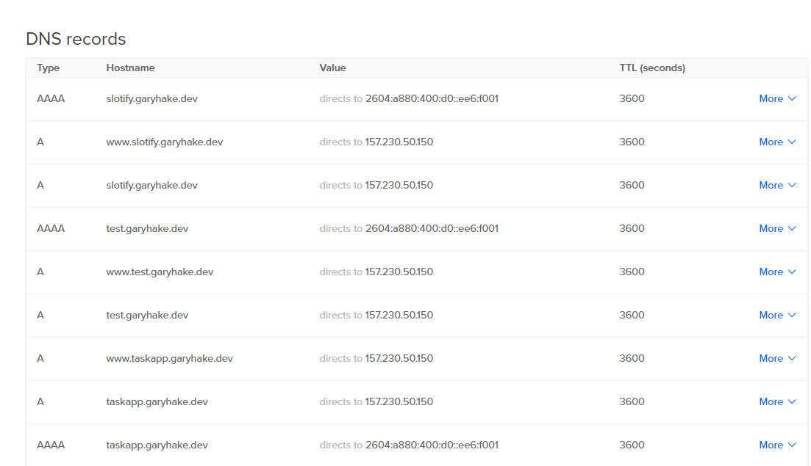
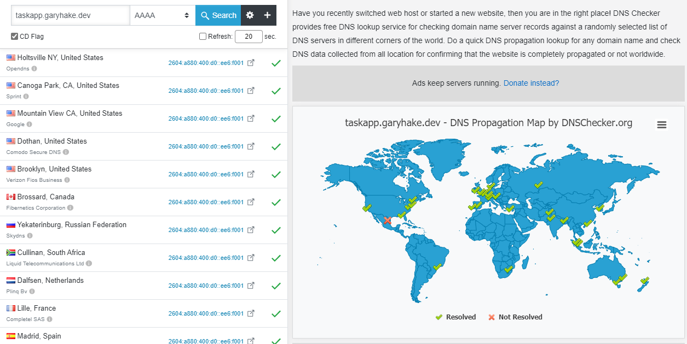
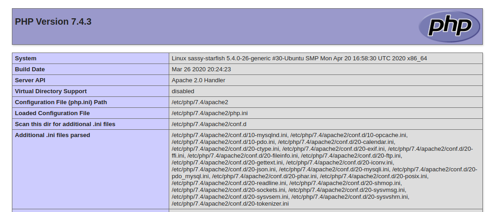
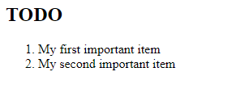

# Digital Ocean LAMP Setup

[Digital Ocean](https://www.digitalocean.com/) is a cloud service provider for deploying web apps

I'm using it for deploying personal web sites for my portfolio

## LAMP

[LAMP Stack](<https://en.wikipedia.org/wiki/LAMP_(software_bundle)>)

1. Linux (Ubuntu)
1. Apache
1. MySql
   - phpMyAdmin Client
1. PHP

I've been getting interested in PHP, so my first foray into DO droplets was in setting up a lamp stack

## Recommended Software

1. [PuTTYGen](https://www.putty.org/)
   - Generating ssh keys
1. [PuTTY](https://www.putty.org/)
   - ssh into server once it's created
1. [WinSCP](https://winscp.net/eng/download.php)
   - Editing on server
   - Copying code to server

# Setup

DO has a LAMP image on the marketplace, but I opted to manually build my stack

## Generate SSH Key

[DO Walkthrough](https://www.digitalocean.com/docs/droplets/how-to/add-ssh-keys/create-with-putty/)

1. Open PuttyGen
   - 
1. RSA is default and fine for our purposes
1. Click Generate (and move the mouse when prompted)
1. Public key will be generated
   - This is what you will copy and use in DO
1. You'll be prompted for a passphrase
   - You'll be prompted when accessing server
1. Save the private key after
   - Public key is what you pasted to DO
1. When connecting to the server through putty you'll use this key

## Create Droplet

1. I chose the Ubuntu droplet
1. Make sure you click the IPv6 and Monitoring data checkboxes
   - IPv6 will be for securing our apps later
1. Create a SSH key
   - This is the public key you copied in the previous step
1. Pick whichever settings make sense
   - Size of box, hostname
1. Hit create
1. So, I never get emailed the inital root password to the linux box
   - Manually reset the password
   - It will then email you the new temp password
     

## Connect Putty to Linux Box

- Digital Ocean does have a built in console
  - It tends to go dead quickly

[DO Documentation](https://www.digitalocean.com/docs/droplets/how-to/connect-with-ssh/putty/)

1. Fill in host name on putty configuration
   - Port 22
1. Verify SSH Protocol
   - Left nav, SSH
   - Make sure 2 is selected for ssh protocol version
1. Specify an SSH key
   - Under SSH Key, there's an Auth section
   - Browse for the private key (ends in .ppk)
1. Add Username
   - 'root' to start
   - After you've logged in, you'll create a non root sudo user, update this after
   - Bad form to use root all the time
1. Save the Session!
   - Pain in the ass if you don't
1. First time connecting
   - Putty will ask to confirm you trust the server (say yes)
1. You're in!
   - Refer to DO Documentation if you ran into problems

## Initial Server Setup

[DO Documentation](https://www.digitalocean.com/community/tutorials/initial-server-setup-with-ubuntu-20-04)

1. Create a new user
   ```bash
   adduser gary
   ```
   - You will be asked questions about the user (name, etc)
1. Grant Admin Privileges
   ```bash
   usermod -aG sudo gary
   ```
1. Set up basic firewall
   - Ubuntu servers can use the UFW firewall to make sure only connections to certain services are allowed
   ```bash
   ufw app list
   ```
   - This shows that we only have OpenSSH available, but not enabled
   ```bash
   ufw allow OpenSSH
   ufw enable
   ufw status
   ```
   - Only SSH connections are allowed. We will add more as we need them
1. Enable external access for your regular user

   - We are using ssh authentication
   - We are going to copy the root user's ssh directory to our created user

   ```bash
   rsync --archive --chown=gary:gary ~/.ssh /home/gary
   ```

   - You'll have to `sudo` everything, and will be prompted occasionally for your password
     - Safer this way!

## LAMP Stack

[DO Documentation](https://www.digitalocean.com/community/tutorials/how-to-install-linux-apache-mysql-php-lamp-stack-on-ubuntu-20-04)

### Apache

1. Important, do all of this as your non root user
   - It's a big no-no to run everything as root
1. Install Apache
   ```bash
   sudo apt update
   sudo apt install apache2
   ```
1. Update firewall to allow apache
   ```bash
   sudo ufw app list
   ```
   - You'll see Apache, Apache Full, Apache Secure available
   - Walkthrough above has you just install Apache, we're gonna eventually want ssl, so do full
   ```
   sudo ufw allow in "Apache Full"
   ```
1. Go to `http://your_server_ip`
   - ip address is available on DigitalOcean
   - We will do DNS links later
     

### Install MySql

1. Initial install
   ```bash
   sudo apt install mysql-server
   ```
1. Once finished, run a security script that comes pre-installed
   ```bash
   sudo mysql_secure_installation
   ```
   - This will ask if you want to configure the VALIDATE PASSWORD PLUGIN
   - I vote no, it causes issues w/ phpMyAdmin later
   - Press Y and enter at each prompt
     - Removes anonymous users and the test db
1. Test msql is working
   ```bash
   sudo mysql
   ```
   - You should see a 'Welcome to MySQL' result
   - Type exit to...exit
1. Create non root user
   ```sql
   CREATE USER 'gary'@'localhost' IDENTIFIED BY 'password';
   ```
   ```sql
   GRANT ALL PRIVILEGES ON * . * TO 'gary'@'localhost';
   ```
1. The recommendation is to do a separate user per database
   - If you're lazy like me...you just do one
   - I'd use root if it wasn't frowned upon

### Install PHP

1. The easiest of the bunch
   ```bash
   sudo apt install php libapache2-mod-php php-mysql
   ```
1. Check it installed
   ```bash
   php -v
   ```
1. If you're following the DO walkthrough, it then has you create virtual hosts and create a test app to test the stack
   - Feel free to do so, but I'll have notes after installing PHPMyAdmin to do just that as well

## Install PHPMyAdmin

[DO Documentation](https://www.digitalocean.com/community/tutorials/how-to-install-and-secure-phpmyadmin-on-ubuntu-20-04)

1. Once the dabase is installed, I recommend a sql client to manage it
   - Command line sql is no fun
1. Install phpMyAdmin

   ```bash
   sudo apt update

   sudo apt install phpmyadmin php-mbstring php-zip php-gd php-json php-curl
   ```

1. VERY IMPORTANT
   - When the first prompt appears, apache2 is highlighted, but not selected
   - If you do not hit "SPACE" to select Apache, the installer will not move the necessary files during installation
   - Hit "SPACE", "TAB", and then "ENTER" to select Apache.
1. If you mess that up, no worries, run the below commands
   ```bash
   sudo ln -s /etc/phpmyadmin/apache.conf /etc/apache2/conf-available/phpmyadmin.conf
   sudo a2enconf phpmyadmin
   sudo /etc/init.d/apache2 reload
   ```
1. If you set up a non root user during MySql setup, you can use that use to log into phpMyAdmin
1. If you are using root, you need to configure the password

   ```bash
   sudo mysql
   ```

   ```sql
   SELECT user,authentication_string,plugin,host FROM mysql.user;
   ```

   - Notice how the admin is using the 'auth_socket'
   - We need to change that to `mysql_native_password`

   ```sql
   ALTER USER 'root'@'localhost' IDENTIFIED WITH mysql_native_password BY 'password';
   ```

1. It's recommended to further protect your phpMyAdmin instance by requiring it's own password to access

   - First enable use of .htaccess file overrides by editing the config file
   - Use WinSCP (or edit in bash) `/etc/apache2/conf-available/phpmyadmin.conf`
   - Edit the `/etc/phpmyadmin/apache.conf` if you went the symbolic link route
   - Add `AllowOverride All`

   ```conf
   <Directory /usr/share/phpmyadmin>
    Options SymLinksIfOwnerMatch
    DirectoryIndex index.php
    AllowOverride All
    . . .
   ```

   - Restart apache

   ```
   sudo systemctl restart apache2
   ```

   - Edit `/usr/share/phpmyadmin/.htaccess`

   ```conf
   AuthType Basic
   AuthName "Restricted Files"
   AuthUserFile /etc/phpmyadmin/.htpasswd
   Require valid-user
   ```

   - Create a password file

   ```bash
   sudo htpasswd -c /etc/phpmyadmin/.htpasswd username
   ```

   - You will be prompted to select and confirm a password
   - Create a user

   ```bash
   sudo htpasswd /etc/phpmyadmin/.htpasswd additionaluser
   ```

   - Restart apache `sudo systemctl restart apache2`

1. Now when you access phpMyAdmin it will prompt you for a username and password
   - I didn't end up doing this step, as signing in as the db user is enough for my purposes

# Installing Apps

So we've installed a bunch of stuff, but does it all play nice together?

Our goal is to have a url route to an app:

1. https://slotify.garyhake.dev
1. https://taskapp.garyhake.dev

We want to do a few things

1. We need to set up a Domain
   - garyhake.dev for example
   - Ain't free, so needs to be bought
   - I ended up using google to buy my domain
1. We want to set up virtual hosts on apache
   - This lets us host multiple sites
1. Set up test database and test php files
   - Lets us test that apache can call php
   - Lets us test that php can connect and get info from mysql

## Domain Registration

1. There's lots of places to buy a domain
   - Pick your favorite and what'll save you the most money
   - domains.google is what I used
1. I used custom name servers from Digital Ocean
   - [DO Documentation](https://www.digitalocean.com/community/tutorials/how-to-point-to-digitalocean-nameservers-from-common-domain-registrars#registrar-google-domains)
   - This lets me manage my DNS from DO
     
1. Add your domain to DO
   - [Documentation](https://www.digitalocean.com/docs/networking/dns/how-to/add-domains/)
   - Create > Domains/DNS
   - Enter domain into name field and Add Domain
     
1. You've done all of this because you want to host an app
   - It requires a sub domain
   - [How to Add](https://www.digitalocean.com/docs/networking/dns/how-to/add-subdomain/)
     
   - The key is you have two 'A' records and one 'AAAA' record
1. To make sure this is working from this end
   - You need to check the DNS
   - [DNS Checker](https://dnschecker.org/#AAAA/taskapp.garyhake.dev)
     
1. This is just the start of getting an app running
   - We know now that we can at least hit these urls when we get an app copied over to the server (at least over http)
   - We aren't secured for https on the server yet

## Set Up Apache Virtual Hosts

[DO Documentation](https://www.digitalocean.com/community/tutorials/how-to-install-linux-apache-mysql-php-lamp-stack-on-ubuntu-20-04#step-4-%E2%80%94-creating-a-virtual-host-for-your-website)

1. Create the Directory Structure
   ```bash
   sudo mkdir /var/www/test.garyhake.dev
   ```
   - This is where site code goes
1. Grant Permissions
   ```bash
   sudo chown -R $USER:$USER /var/www/test.garyhake.dev
   ```
   - Perms for www folder
   ```bash
   sudo chmod -R 755 /var/www
   ```
1. Create a configuration file
   - This is how apache will server your site
   ```bash
   sudo nano /etc/apache2/sites-available/test.garyhake.dev.conf
   ```
   - Copy the below into this file
   ```bash
   <VirtualHost *:80>
      ServerName test.garyhake.dev
      ServerAlias www.test.garyhake.dev
      ServerAdmin webmaster@localhost
      DocumentRoot /var/www/test.garyhake.dev
      ErrorLog ${APACHE_LOG_DIR}/error.log
      CustomLog ${APACHE_LOG_DIR}/access.log combined
   </VirtualHost>
   ```
1. Enable your virtual host
   ```bash
   sudo a2ensite test.garyhake.dev
   ```
1. Disable deafult site that comes w/ apache
   ```
   sudo a2dissite 000-default
   ```
1. Test config file
   ```bash
   sudo apache2ctl configtest
   ```
1. Reload apache
   ```
   sudo systemctl reload apache2
   ```
1. Create Demo Page

   ```bash
   nano /var/www/test.garyhake.dev/index.html
   ```

   ```html
   <html>
   	<head>
   		<title>test.garyhake.dev website</title>
   	</head>
   	<body>
   		<h1>Hello World!</h1>

   		<p>This is the landing page of <strong>test.garyhake.dev</strong>.</p>
   	</body>
   </html>
   ```

1. You can right now access this page w/ your ip address directly
   - We don't have https security set up, so using our domain won't work just yet
1. Final thing, change DirectoryIndex on apahce
   - It will prefer index.html over index.php
   - We want to switch that
   ```
   sudo nano /etc/apache2/mods-enabled/dir.conf
   ```
   - Move index.php to be first
   - Reload apache
   ```
   sudo systemctl reload apache2
   ```

## Securing Your Subdomains on Apache

[DO Documentation](https://www.digitalocean.com/community/tutorials/how-to-secure-apache-with-let-s-encrypt-on-ubuntu-20-04)

- This will give your apps https

1. Install certbot
   ```
   sudo apt install certbot python3-certbot-apache
   ```
1. The above walkthrough will have you setup a .conf file and allow https through the firewall
   - This should all be done
1. Optain ssl cert
   ```
   sudo certbot --apache
   ```
   - It will ask for valid email
   - Ask to register for email list
   - Will ask which sites you'd like to active https for
   - Will ask to redirect http to https
1. By default certbot does auto renewals of your ssl certs
1. You should now be able to use your domain specified above and not use your ip address
   - https://test.garyhake.dev

## Testing PHP Processing

1. Create new file named `info.php` inside custom web root

   ```
   nano /var/www/test.garyhake.dev/info.php
   ```

   - Copy the below code to it

   ```php
   <?php
   phpinfo();
   ```

1. Save and close
1. Navigate to https://test.garyhake.dev/info.php
   
1. This will prove that apache is rendering php

## Test Database Connection From PHP

1. Create test database
   ```
   sudo mysql
   ```
   - Remember we are using the non root user
   ```sql
   CREATE DATABASE example_database;
   ```
1. Create todo_list table
   ```sql
   CREATE TABLE example_database.todo_list (
      item_id INT AUTO_INCREMENT,
      content VARCHAR(255),
      PRIMARY KEY(item_id)
   );
   ```
1. Insert some test data
   ```sql
   INSERT INTO example_database.todo_list (content) VALUES ("My first important item");
   ```
   - Run the above a few times w/ different data
   ```sql
   SELECT * FROM example_database.todo_list;
   ```
1. Create todo_list.php

   ```php
   nano /var/www/your_domain/todo_list.php
   ```

   ```php
   <?php
      $user = "gary";
      $password = "password";
      $database = "example_database";
      $table = "todo_list";

      try {
      $db = new PDO("mysql:host=localhost;dbname=$database", $user, $password);
      echo "<h2>TODO</h2><ol>";
      foreach($db->query("SELECT content FROM $table") as $row) {
         echo "<li>" . $row['content'] . "</li>";
      }
      echo "</ol>";
      } catch (PDOException $e) {
         print "Error!: " . $e->getMessage() . "<br/>";
         die();
      }
   ```

1. Navigate to https://test.garyhake.dev/todo_list.php

   

# Final Thoughts

1. This is an invovled process
   - Google is your friend
1. A core php app is actually easier to get working than a framework one
1. CodeIgniter was a challenge to get running
1. I need to add more notes on how I got my php apps running
1. To get any app working, you need to follow the above steps
   - Create subdomain in DO
   - Create subdomain folder in apache
   - Create conf file
   - Enable the site in apache and restart
1. You'll need to set up databases for your apps (phpmyadmin is your friend here)
   - Make sure your connection info is updated when you copy apps over
1. I'm manually moving app code over thru WinSCP
   - It is possible to connect github thru apache
1. The php installation on apache may be missing extensions your apps need
   - You need to make sure your app is in dev mode and reporting errors, or check logs
   - php.ini will have settings to turn this on
     - display_errors = on, error_reporting = on
   - Your .env file will have a CI_ENVIRONMENT var
   - Setting this to development will show server errors in the browser
   - Turn to PRODUCTION when it's working!
1. A note on CodeIgniter

   - We are hiding the `index.php` from the url
   - Requires us to add a .htaccess to our public folder
   - We separate public code (css, js, index) from app code

   ```
   # Disable directory browsing
   Options All -Indexes

   # ----------------------------------------------------------------------
   # Rewrite engine
   # ----------------------------------------------------------------------

   # Turning on the rewrite engine is necessary for the following rules and features.
   # FollowSymLinks must be enabled for this to work.
   <IfModule mod_rewrite.c>
      Options +FollowSymlinks
      RewriteEngine On

      # If you installed CodeIgniter in a subfolder, you will need to
      # change the following line to match the subfolder you need.
      # http://httpd.apache.org/docs/current/mod/mod_rewrite.html#rewritebase
      # RewriteBase /

      # Redirect Trailing Slashes...
      RewriteCond %{REQUEST_FILENAME} !-d
      RewriteRule ^(.*)/$ /$1 [L,R=301]

      # Rewrite "www.example.com -> example.com"
      RewriteCond %{HTTPS} !=on
      RewriteCond %{HTTP_HOST} ^www\.(.+)$ [NC]
      RewriteRule ^ http://%1%{REQUEST_URI} [R=301,L]

      # Checks to see if the user is attempting to access a valid file,
      # such as an image or css document, if this isn't true it sends the
      # request to the front controller, index.php
      RewriteCond %{REQUEST_FILENAME} !-f
      RewriteCond %{REQUEST_FILENAME} !-d
      RewriteRule ^([\s\S]*)$ index.php/$1 [L,NC,QSA]

      # Ensure Authorization header is passed along
      RewriteCond %{HTTP:Authorization} .
      RewriteRule .* - [E=HTTP_AUTHORIZATION:%{HTTP:Authorization}]
   </IfModule>

   <IfModule !mod_rewrite.c>
      # If we don't have mod_rewrite installed, all 404's
      # can be sent to index.php, and everything works as normal.
      ErrorDocument 404 index.php
   </IfModule>

   # Disable server signature start
      ServerSignature Off
   # Disable server signature end
   ```

   - This is the .htaccess file I created to get it working
   - Was a pain to figure out
