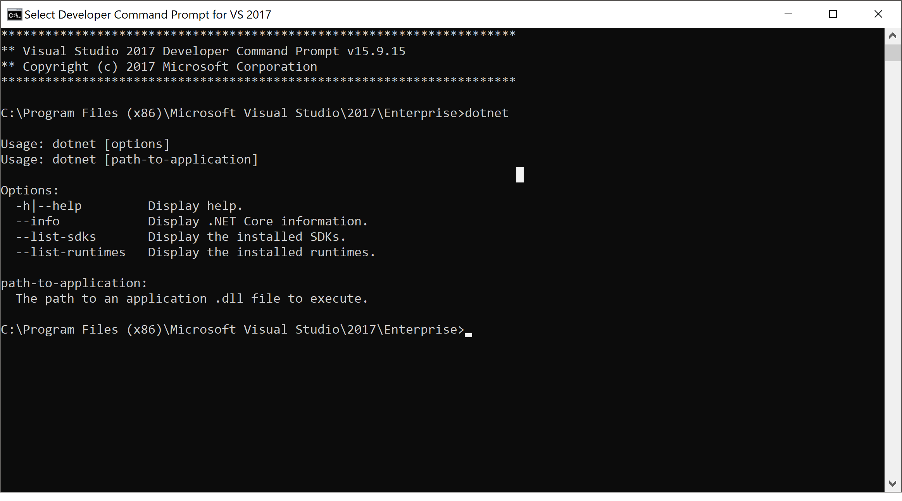

# Lesson One 'Hello World'

[Online Link](https://docs.microsoft.com/en-us/dotnet/core/tutorials/with-visual-studio-code)

This will be a simple lesson to create an application that 'prints' (output, but we'll review what print means) 'Hello World' in c#

We will do the following

1. Download the .net core SDK
    - SDK stand for Software Development Kit
    - [Download Link](https://dotnet.microsoft.com/download)
1. Download Visual Studio Code
    - This will be the 'IDE' we will use to actually code
    - IDE stands for Interactive Development Environment
1. Create a simple application that will print 'Hello World'

## Downlaod .Net Core SDK

### What is .Net? (Needs work)

[.Net](https://en.wikipedia.org/wiki/.NET_Framework) is a microsoft 'framework' that Microsoft created that allows software to run
- The idea is that if you want to create something in the Microsoft ecosystem, you can create it in .net and it will work on any supported system

.Net Core is the version of .Net that is 'Open Source'
- Open Source simply means you don't have to pay to use it
- Publicly available

To create something in .Net originally, you had to 'pay to play'
- Microsoft got smart and created .Net Core that is 'Open Source'

### .Net Core

.Net core is almost identical to regular .Net
- Eventually Microsoft will only support Core

1. [Download Link](https://dotnet.microsoft.com/download)
    - We will be downloading the most recent version of the SDK
        - Don't worry about the version that is compatible with 'Visual Studio'
1. Confirm the Download Worked (and intro to command lines!)
    - Open the Windows command line
        - Hit the window button, and type 'cmd'
    - Once it's open, type 'dotnet'


### VS Code

VS Code is primarily a file editor, but it's fast becoming the 'go-to' editor for applictions written in: .net core, java

It also can read and edit almost any file, along with a huge list of extensions

1. [Download](https://code.visualstudio.com/)
1. Install the c# extension
    - Go the 'Extensions' tab (Left Nav panel, square)
    - Type c# into search

### Hello World

1. Have them open a folder in VS Code
    - Name it 'helloWorld'
1. Open Terminal: View -> Terminal
    - Or: Right click folder -> Open in Terminal
1. Type
    ```
    dotnet new console
    ```
1. Should have a new c# project created with some new files
    - May need to resolve build assets
    ```
    dotnet restore
    ```
1. Run the program
    - Either type:
    ```
    dotnet run
    ```
    - Or press F5

### Debugging

Debugging is when we put 'breaks' in our code so that we can see what's happening at a specific point

Debugging is one of the most powerful and usefull pieces of a programming framework

1. Go to 'Program.cs'
1. Find the line that says "Hello World"
1. You'll see line numbers. Click to the left of the number
    - A red dot should appear
1. Press 'F5'
    - The code will stop where you put the red dot

This is called 'setting a breakpoint'
- Literally putting a place in code where running stops

1. F10 is 'Step Over'
    - Goes to the next line
1. F11 is 'Step Into'
    - We'll get into that later

There are also controls at the top of the app:


### Adding a Class

A Class is a file with a .cs file type (ie Program.cs)

Usually we create a class to represent a single thing
- A 'shape' class, or a 'Person' class

1. In the 'helloWorld' folder right click and 'New File'
    - Name the file 'MyClass.cs'
1. Add the below code
    ```cs
    using System;

    namespace helloWorld
    {
        public class MyClass
        {
            public string ReturnMessage()
            {
                return "Happy coding!";
            }
        }
    }
    ```
1. The section 'ReturnMessage' is called a 'function'
1. In the 'Program.cs' class file replace the code in the 'Main' function with:
    ```cs
        MyClass c1 = new MyClass();
        Console.WriteLine($"Hello World! {c1.ReturnMessage()}");
    ```

So, we created a new class, 'instantiated' it in our Main class and refrenced a 'function' within that class